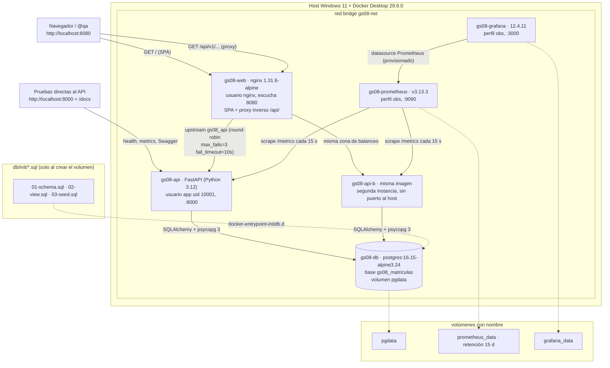
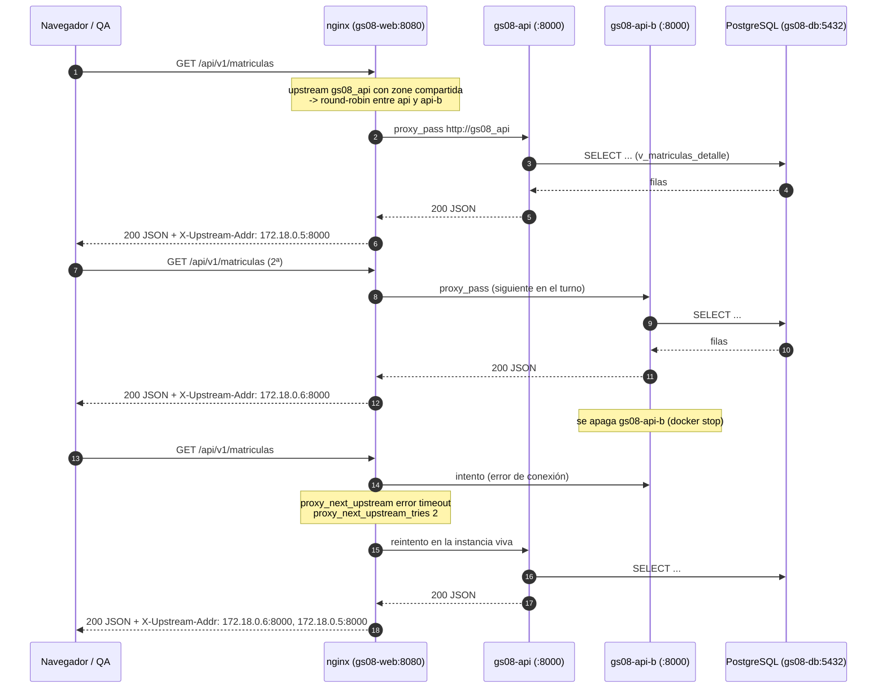
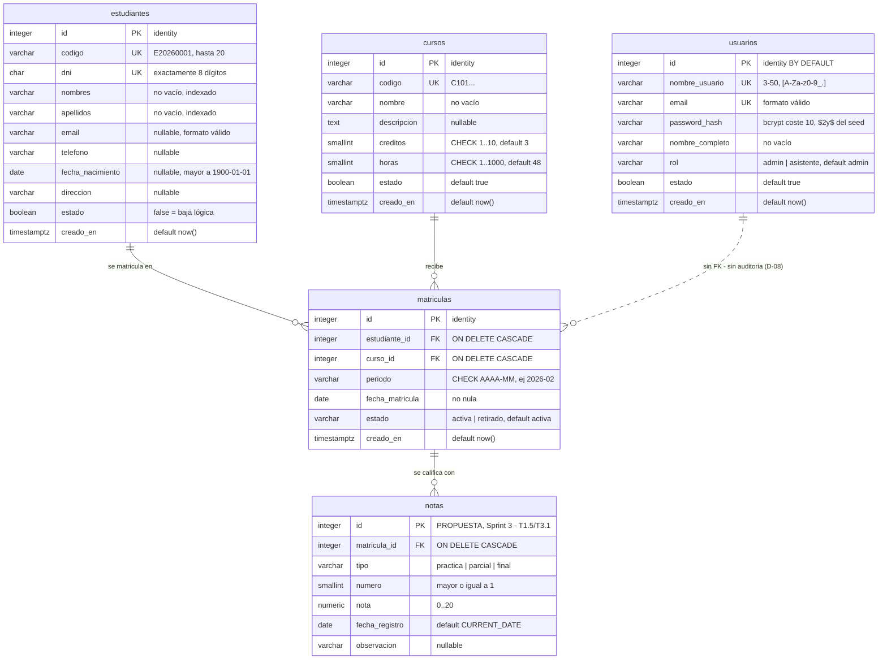
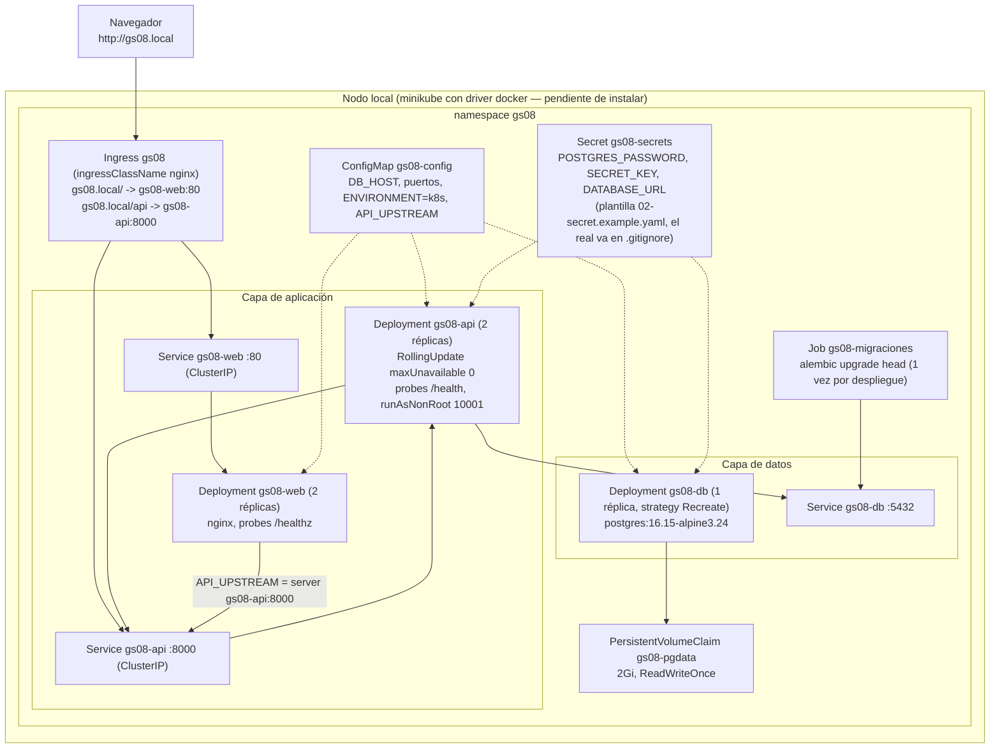
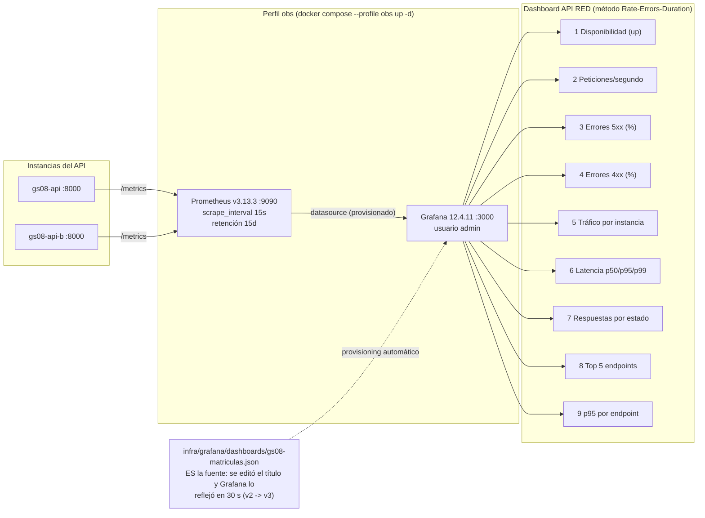

# GS08 · Matrículas y Notas — Arquitectura

**Entregable:** TD-02 de `docs/backlog-sprints.md` · **Redacta:** @documentador · **Fecha:** 21/09/2026
**Rama:** `main` @ `e051d43` · **Repo:** `D:\dev\equipo\gs08-matriculas`

Este documento **no inventa nada**: cada diagrama sale de un archivo del repositorio o de una salida real,
y cada uno dice de dónde. Los datos técnicos que lo respaldan están en `docs/devops/evidencia-sprint0.md`
(infraestructura, §1-2 y §5), `docs/devops/plan-contenedores-ci.md` (diseño) y `docs/analisis/modelo-datos.md`
§1 (modelo de datos).

**Aviso de estado, para leer los diagramas:** lo que **existe y corre** hoy es la infraestructura (compose,
PostgreSQL con el esquema del legacy, nginx balanceando 2 instancias, Prometheus/Grafana) y el **API real**
(28 endpoints publicados, probado contra una base limpia: 22 de los 39 criterios con corrida verde). **El SPA
es T2.4** y el compose todavía sirve el **stub de humo** en `:8080` (retirarlo es T2.6), así que los diagramas
de componentes y de flujo describen la arquitectura ya construida *alrededor* de ese código: el balanceo, el
failover y la observabilidad son reales; el SPA del diagrama §1 es el que falta.

## Índice

1. [Vista de componentes (Docker Compose)](#1-vista-de-componentes-docker-compose)
2. [Flujo de una petición: balanceo y failover](#2-flujo-de-una-petición-balanceo-y-failover)
3. [Modelo de datos](#3-modelo-de-datos)
4. [Despliegue en Kubernetes](#4-despliegue-en-kubernetes)
5. [Observabilidad](#5-observabilidad)
6. [Decisiones de arquitectura que explican estos diagramas](#6-decisiones-de-arquitectura-que-explican-estos-diagramas)

---

## 1. Vista de componentes (Docker Compose)

**Fuente:** `docker-compose.yml` (servicios `db`, `api`, `api-b`, `web`, perfil `obs` con `prometheus` y
`grafana`), `frontend/nginx/default.conf.template`, `backend/Dockerfile`, `frontend/Dockerfile`.
**Evidencia de que levanta:** `docker compose --profile obs ps` → 6 contenedores healthy
(`docs/devops/evidencia-sprint0.md` §2).



**Puertos publicados al host:** `8080` (web), `8000` (api), `5432` (db), `9090` (prometheus), `3000` (grafana).
**`api-b` no publica puerto a propósito:** solo lo alcanza nginx por la red interna.
**Un contenedor por servicio, imágenes alpine y usuario no root:** el porqué está en
`docs/seguridad-etica-sostenibilidad.md` §3.

---

## 2. Flujo de una petición: balanceo y failover

**Fuente:** `frontend/nginx/default.conf.template` (bloque `upstream gs08_api` con `zone`, `keepalive` y
`proxy_next_upstream`) y `docker-compose.yml` (`API_UPSTREAM` con dos `server` y `max_fails=3 fail_timeout=10s`).
**Evidencia real:** `docs/devops/evidencia-sprint0.md` §3 (12 peticiones alternando `172.18.0.5`/`172.18.0.6`)
y la verificación independiente de @qa (`docs/qa/plan-pruebas.md` §8: 6 peticiones, 3 y 3; y **failover con
las 6 en HTTP 200** con `gs08-api-b` apagado).



**Cómo se reproduce (un comando, sin tocar nada):**

```bash
for i in $(seq 1 6); do curl -s -o /dev/null -D - http://localhost:8080/api/v1/health | grep -i x-upstream-addr; done
```

**Dos detalles que costaron hallazgos y ya están corregidos** (`docs/devops/evidencia-sprint0.md` §8):

- Sin `zone gs08_api 64k;` cada **worker** de nginx lleva su propio contador y el round-robin salía desparejo
  (todo caía en una instancia). Con la zona, el reparto es 1 a 1.
- Sin `max_fails`/`fail_timeout` + `proxy_next_upstream error timeout`, una instancia que aún no aceptaba
  conexiones al arrancar quedaba penalizada y no había reintento. **Nota deliberada:** solo se reintenta en
  `error timeout`, **no** en 5xx: reintentar un 5xx repetiría escrituras.

---

## 3. Modelo de datos

**Fuente:** `docs/analisis/modelo-datos.md` §1 (traducción de `legacy/script.sql.txt`, MySQL 8 → PostgreSQL 16)
y `db/init/01-schema.sql`, `02-view.sql`, `03-seed.sql`.
**Evidencia:** `bash db/verificacion/ejecutar_verificacion.sh` → **49 comprobaciones OK, exit 0** (incluye 15
pruebas negativas que exigen que la base **rechace** cada regla violada).



**Objetos y reglas, en números** (`docs/analisis/modelo-datos.md` §1 y §3):

| Objeto | Qué tiene | Dónde vive |
|---|---|---|
| `usuarios`, `estudiantes`, `cursos`, `matriculas` | 4 tablas · **16 CHECK** · **6 UNIQUE** · **2 FK** · **7 índices** | `db/init/01-schema.sql` |
| `v_matriculas_detalle` | JOIN `matriculas + estudiantes + cursos`, **24 filas** con el seed | `db/init/02-view.sql` |
| Seed | 1 admin · 12 estudiantes · 7 cursos · **24 matrículas (23 activas + 1 retirada)** | `db/init/03-seed.sql` |
| La regla central | **`UNIQUE (estudiante_id, curso_id, periodo)`** — un estudiante no repite curso en el mismo periodo | `uq_matriculas_estudiante_curso_periodo` |
| `notas` | **propuesta escrita, no aplicada.** Entra en el Sprint 3 (D-01) como esquema **aditivo**: no se toca ninguna de las 4 tablas | `docs/analisis/modelo-datos.md` §7 |

**Dos cosas que el diagrama no dice y conviene tener presentes:**

- **`periodo` es `varchar(7)`** con CHECK `^[0-9]{4}-(0[1-9]|1[0-2])$`: en MySQL la columna aceptaba 10
  caracteres y el formato lo validaba PHP, así que `2026-13` entraba. Ahora lo rechaza la base.
- **`estado` pasa de `TINYINT(1)` a `boolean`**: en el JSON de la API eso es `true`/`false`, no `1`/`0`.
  Avisado a @dev y @qa por @analista (`modelo-datos.md` §8).

---

## 4. Despliegue en Kubernetes

**Fuente:** `k8s/kustomization.yaml` + los 7 manifiestos que referencia; render verificado con
`kubectl kustomize k8s/` → **11 objetos** (`docs/devops/evidencia-sprint0.md` §5, reconfirmado el 21/09/2026).

> **Estado real: manifiestos listos, cluster NO desplegado en esta máquina.** `kubectl config current-context`
> → `error: current-context is not set`; `minikube`/`kind`/`k3s` **no están instalados** y su instalación
> espera la decisión del dueño (**A-02**). El criterio `C-37` («3/3 pods Running y respuesta por el ingress»)
> está **bloqueado**, y se escribe así: *pendiente — bloqueado por A-02 / T1.6*.
> Lo que sí está validado: el render de kustomize (estructura y referencias cruzadas entre objetos), no el
> despliegue.



**Los 11 objetos** (salida de `kubectl kustomize k8s/`, en orden de render):

| # | Kind | Nombre | Para qué |
|---|---|---|---|
| 1 | Namespace | `gs08` | todo vive en su namespace |
| 2 | ConfigMap | `gs08-config` | configuración no sensible |
| 3 | Service | `gs08-api` | ClusterIP `:8000` |
| 4 | Service | `gs08-db` | ClusterIP `:5432` |
| 5 | Service | `gs08-web` | ClusterIP `:80` → `8080` del contenedor |
| 6 | PersistentVolumeClaim | `gs08-pgdata` | 2Gi, `ReadWriteOnce` |
| 7 | Deployment | `gs08-api` | 2 réplicas, `RollingUpdate` sin caídas |
| 8 | Deployment | `gs08-db` | 1 réplica, `Recreate` (RWO no se monta dos veces) |
| 9 | Deployment | `gs08-web` | 2 réplicas |
| 10 | Job | `gs08-migraciones` | `alembic upgrade head` una vez por despliegue |
| 11 | Ingress | `gs08` | un solo host para SPA y API |

**Nota de coherencia (D-14):** en el cluster el DDL inicial lo aplica **Alembic**, no `db/init/` — el Job
`gs08-migraciones` corre `alembic upgrade head`. Por eso la revisión inicial de Alembic se genera **desde**
`db/init/` y hay una sola fuente de verdad del esquema.

Comandos exactos para levantarlo cuando se apruebe minikube: `docs/devops/COMANDOS.md` §5.

---

## 5. Observabilidad

**Fuente:** `infra/prometheus/prometheus.yml`, `infra/grafana/provisioning/*`,
`infra/grafana/dashboards/gs08-matriculas.json`, `docs/devops/plan-contenedores-ci.md` §5.
**Evidencia:** `docs/devops/evidencia-sprint0.md` §4 (3 targets `up`, consultas de los paneles con tráfico
real: 0,517 req/s · 3,12 % 5xx · 8,13 % 4xx · p95 0,095 s) y la corrida de `verificar_stack.py` del
21/09/2026 22:44: *«targets Prometheus: 3 targets, caidos: ninguno»*, *«paneles Grafana con datos: 9 paneles
revisados, sin datos: ninguno»*.



**Lecturas clave de los paneles** (`docs/devops/plan-contenedores-ci.md` §5):

- **Panel 1 (up):** 2/2 vivas = todo OK; una **CAÍDO** con tráfico en la otra demuestra que nginx y el
  servicio sobreviven — es la vista en vivo del failover del §2.
- **Panel 3 vs 4:** 5xx debe ser **0**; un 4xx alto con 5xx en 0 es buena señal: significa que las reglas de
  negocio están rechazando lo que deben (401, 404, 409).
- **Panel 6:** criterio del MVP, p95 < 0,5 s (medido: 0,095 s con el stub; se repite con el API real, T2.6).

**Limitación declarada:** no hay paneles de PostgreSQL ni de nginx. Ninguno de los dos expone métricas en
formato Prometheus sin un exporter propio; el job de nginx que existía se eliminó porque fallaba
(`ok\n` no es formato Prometheus). Agregar `postgres-exporter` y `nginx-prometheus-exporter` es Sprint 1 si
el tiempo alcanza (`docs/devops/plan-contenedores-ci.md` §5 y §7).

---

## 6. Decisiones de arquitectura que explican estos diagramas

Citadas **tal cual** de `docs/decisiones.md` (no se reescriben, D-20):

| Decisión | Qué fija | Dónde se ve en este documento |
|---|---|---|
| **D-00** | Stack: FastAPI + PostgreSQL 16 + Vue 3 (Vite) + Tailwind, Docker, GitHub Actions, Kubernetes local, Prometheus + Grafana. Se reimplementa el legacy, no se migra | §1, §4, §5 |
| **D-14** | Una sola fuente de verdad del esquema: la revisión inicial de Alembic se genera desde `db/init/` | §3 y §4 (Job de migraciones) |
| **D-17** | Health por el proxy en `/api/v1/health`; `/metrics` **directo** en `:8000`; nginx **404** en `/health` y `/metrics` | §1, §2, §5 |
| **D-04** | Kubernetes local con minikube y driver `docker`; instalarlo requiere aprobación del dueño | §4 |
| **D-11** | Buscador con `ILIKE` (+ `unaccent` para tildes), nunca `LIKE` | §3 (nota de `periodo`/buscador) |
| **D-02** | Borrar estudiante o curso con matrículas no borra en cascada silenciosa: `409` con el conteo, y `204` solo con `?confirmar=true` | §3 (FK `ON DELETE CASCADE` + regla de la API) |
| **D-01** | Las notas **sí** entran al MVP, en el Sprint 3, como esquema aditivo | §3 (bloque `notas`, marcado como propuesta) |
| **D-08** | Sin auditoría (`creado_por`, triggers) en la v1 | §3 (relación punteada `usuarios` ↔ `matriculas`) |

---

**Archivos de los que sale este documento:** `docker-compose.yml`, `frontend/nginx/default.conf.template`,
`frontend/Dockerfile`, `backend/Dockerfile`, `db/init/*.sql`, `k8s/*.yaml`, `infra/prometheus/prometheus.yml`,
`infra/grafana/**`, `docs/devops/evidencia-sprint0.md`, `docs/devops/plan-contenedores-ci.md`,
`docs/analisis/modelo-datos.md`, `docs/decisiones.md`, `docs/qa/plan-pruebas.md`.
**Verificado por @documentador el 21/09/2026 22:44:** `kubectl kustomize k8s/` (11 objetos),
`docker ps` (7 contenedores), `python scripts/validar_infra.py` (21 OK), `python scripts/verificar_stack.py` (9 OK, exit 0).
